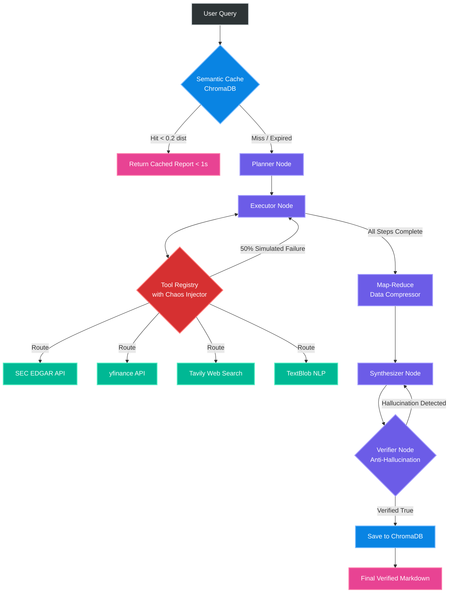
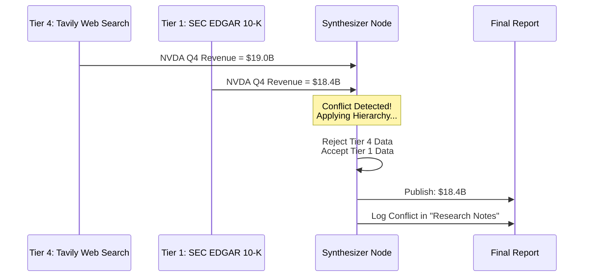

# 🚀 ARA-1: Autonomous Financial Research Agent

> **An advanced, fault-tolerant LangGraph state machine designed to synthesize SEC regulatory filings, live financial data, and market sentiment into verified, investment-grade markdown reports.**

ARA-1 replicates the workflow of a senior financial analyst. It receives complex research queries, independently formulates a multi-step topological research plan, gathers data from disparate sources, resolves conflicting data through a strict **Source Reliability Hierarchy**, and runs a post-generation **Anti-Hallucination Shield** to verify every numerical claim before publication.

---

## 🧠 Cognitive Architecture (LangGraph State Machine)

ARA-1 implements a robust **Plan-and-Execute** cognitive loop with advanced telemetry, semantic caching, and map-reduce context compression.



---

## ✨ Key Features & Engineering Highlights

### 1. Multi-Source Synthesizer (Conflict Resolution Engine)
When disparate data sources disagree, ARA-1 does not blindly average them. It enforces a strict **Source Reliability Hierarchy** to resolve conflicts and select the authoritative figure. 



### 2. Verifier — Anti-Hallucination Shield
A post-generation editing node that acts as a strict Fact-Checking Editor. After the Synthesizer produces a draft:
1. It extracts every numerical claim and metric from the draft report.
2. It cross-references each figure directly against the raw JSON data payload.
3. If a hallucinated figure is detected, it returns a precise error log and flags the discrepancy in the final output.

### 3. Chaos Engineering Resilient
ARA-1 passed the **Challenge 8 Chaos Engineering Gauntlet**. The system features a built-in stress tester that injects a **50% random failure rate** (simulating API timeouts and rate-limit drops) into every tool call. The `ToolRegistry` catches these simulated timeouts, logs them as `fallback_needed`, and triggers autonomous fallback loops without crashing the Python process.

### 4. Map-Reduce Context Compression
Large SEC HTML filings can overwhelm LLM token limits. ARA-1 employs a pre-synthesis **Map-Reduce Data Compressor**. It passes raw payloads through a fast, cheap extraction model to trim out boilerplate, shrinking the context payload by up to 80% before feeding it to the final Synthesizer, preserving both latency and token budgets.

### 5. Sub-Second Semantic Caching
Utilizing **ChromaDB**, the agent embeds every incoming query. If a new query matches a recent historical query with a cosine distance `<= 0.2` and is less than 48 hours old, the agent instantly returns the complete cached Markdown report, bypassing all LLM generation and API execution to achieve `< 1s` latency.

---

## 🛠️ Tech Stack

- **Framework**: LangChain / LangGraph Python Backend
- **LLM**: Google Gemini 2.5 Flash (Free-tier API multiplexing)
- **Vector Database**: ChromaDB (Local persistent storage)
- **Live Tools**: yfinance, SEC EDGAR API, Tavily Web Search, TextBlob (Sentiment Analysis)
- **Validation & Retry Logic**: Pydantic v2, Tenacity

---

## 🚀 Installation & Setup

**1. Clone the repository**
```bash
git clone https://github.com/Paragiscool/Autonomous-Financial-Research-Agent.git
cd Autonomous-Financial-Research-Agent
```

**2. Set up the virtual environment**
```bash
python -m venv venv
# On Windows:
.\venv\Scripts\activate
# On Mac/Linux:
source venv/bin/activate
```

**3. Install dependencies**
```bash
pip install -r requirements.txt
```

**4. Configure Environment Variables**
```bash
cp .env.example .env
```
Open `.env` and add your required keys (`GOOGLE_API_KEY`, `TAVILY_API_KEY`, `SEC_USER_AGENT`).

**5. Run the Benchmark Script**
To verify the semantic caching telemetry and Map-Reduce limits, run the automated benchmark:
```bash
python evaluate.py
```

**6. Run a real research query**
```python
from agent.core import AutonomousResearchAgent

agent = AutonomousResearchAgent(simulate_failures=False)
report = agent.research("Analyze NVIDIA's competitive position in AI chips.", ticker="NVDA")
print(report)
```
