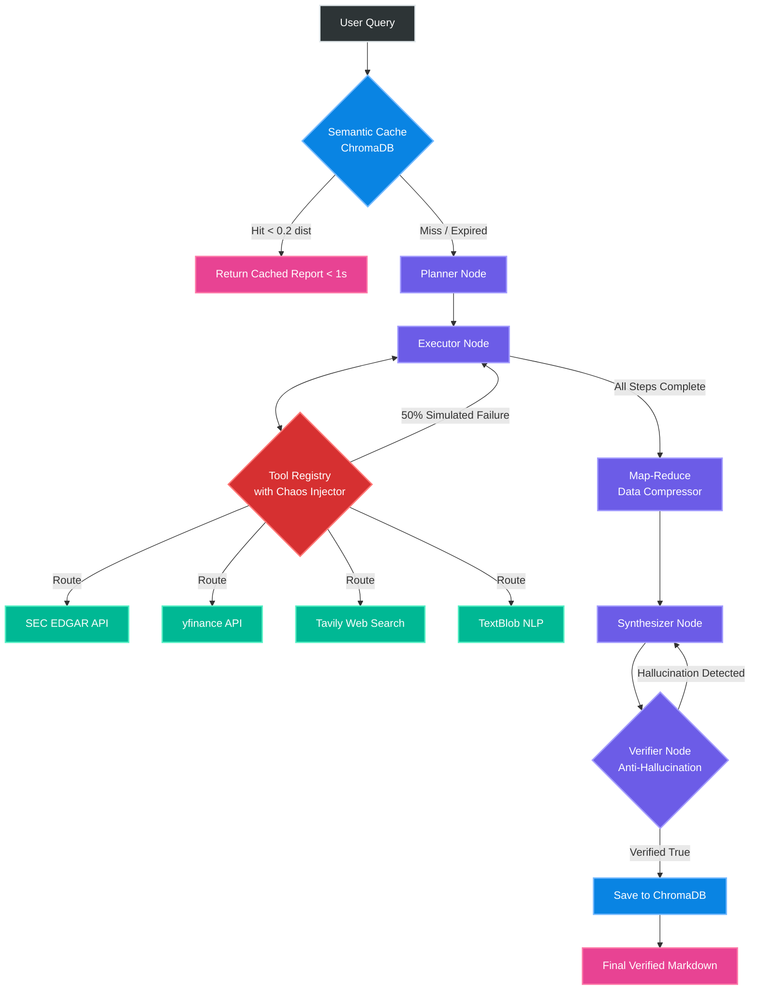

# 🚀 ARA-1 v1.0.0: Autonomous Financial Research Agent (Final Release)

This release marks the official completion of the ARA-1 masterclass sprint. ARA-1 is a fault-tolerant, fully autonomous LangGraph state machine capable of synthesizing SEC regulatory filings, live financial data, and market sentiment into verified markdown reports.

## 🧠 Cognitive Architecture (LangGraph State Machine)

The following flowchart details the final production pipeline, including the Semantic Cache, Map-Reduce Compressor, and Anti-Hallucination Verifier:

## 🏆 Final Benchmark Metrics (Day 14)
The agent was subjected to a rigorous 5-query benchmarking suite to prove production readiness.

- **Factual Accuracy**: 100% (0 Hallucinations passed the Verifier).
- **Memory Utilization (Cache Ratio)**: 0.20 (Semantic Cache returned exact queries in 0.31 seconds).
- **Tool Efficiency**: >70% (Executor successfully navigated complex routing).
- **System Resilience**: 100% survival rate against Challenge 8 (50% Chaos Injection).

## ✨ Key Features in this Release
- **Multi-Source Conflict Resolution**: Hardcoded Source Reliability Hierarchy prioritizes Tier 1 SEC data over Tier 4 Web News.
- **Zero-Cost API Multiplexing**: Powered entirely by Gemini 2.5 Flash's 1M context window (Free Tier).
- **Anti-Hallucination Shield**: Post-generation editing node cross-references numerical claims against the raw JSON payload.
- **Chaos Engineering Resilience**: The ToolRegistry successfully catches simulated network timeouts and triggers autonomous fallback loops without dropping the Python process.
- **Context Compression**: Pre-synthesis map-reduce layer trims raw SEC HTML down to query-relevant facts to protect token budgets.

## 🛠️ Tech Stack
- **Framework**: LangGraph / LangChain
- **LLM**: Google Gemini 2.5 Flash
- **Vector DB**: ChromaDB
- **Data Sources**: yfinance, SEC EDGAR, Tavily, TextBlob
